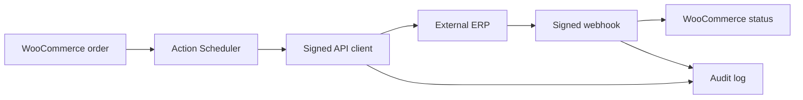

# Architecture

## Reliability decisions

- Order changes enqueue background work instead of delaying checkout.
- An order-revision idempotency key protects the ERP from duplicate writes.
- Failed calls retry with exponential backoff, capped at six attempts.
- Every request outcome is recorded in a dedicated audit table.
- Webhooks are authenticated against the exact raw body and expire after five minutes.
- Order metadata uses WooCommerce CRUD APIs for HPOS compatibility.

## Deliberate scope

Version 1.0.0 is a reference integration, not a universal ERP connector. Field mapping, personally identifiable information policy, and status mapping should be adapted for each production system.
